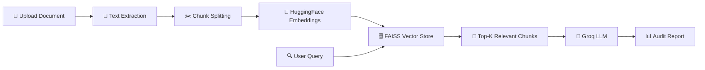

<div align="center">

# 📄 AuditLens AI — Context-Aware Document Auditor

### AI-Powered RAG System for Auditing Contracts, Financial Reports & Source Code

[](https://mudavathsanthosh610-ai-document-auditor-app-ow06yp.streamlit.app/)
[](https://python.org)
[](https://langchain.com)
[](https://opensource.org/licenses/MIT)

> Upload complex documents and get an **evidence-based audit report** that identifies missing information, risks, inconsistencies, and key clauses — powered by RAG (Retrieval-Augmented Generation).

[**🚀 Try Live Demo**](https://mudavathsanthosh610-ai-document-auditor-app-ow06yp.streamlit.app/) · [**🐛 Report Bug**](https://github.com/mudavathsanthosh610/AI-Document-Auditor/issues) · [**💡 Request Feature**](https://github.com/mudavathsanthosh610/AI-Document-Auditor/issues)

</div>

---

## 🎯 What It Does

AuditLens AI is an intelligent document auditing tool that uses **Retrieval-Augmented Generation (RAG)** to analyze uploaded documents and produce structured audit reports. Unlike traditional AI chatbots, it **strictly uses only the content present in your document** — no hallucinations, no assumptions.

### The Problem
- Manual document auditing is **slow, expensive, and error-prone**
- Generic AI tools **hallucinate** and invent information not present in documents
- Legal teams, auditors, and developers waste hours reviewing contracts and code

### The Solution
AuditLens AI provides **evidence-based auditing** with:
- ✅ Zero hallucination — only reports what's in the document
- ✅ Structured 7-section audit reports
- ✅ Source chunk traceability for every finding
- ✅ Pre-built templates for legal, financial, and code audits

---

## ✨ Features

| Feature | Description |
|---------|-------------|
| 📄 **Multi-Format Upload** | Supports PDF, TXT, PY, and JAVA files |
| 🔍 **RAG-Powered Analysis** | FAISS vector search retrieves the most relevant document chunks |
| 🛡️ **Evidence-Based Only** | Strict system prompt prevents AI hallucination |
| 📋 **Audit Templates** | Pre-built templates for Legal/NDA, Financial, and Code Security audits |
| 📊 **Structured Reports** | 7-section output: Explicit Info, Missing Fields, Risks, Obligations, etc. |
| 👁️ **Source Traceability** | View the exact document chunks used for every finding |
| ⚡ **Cloud-Hosted LLM** | Powered by Groq API — fast inference, no GPU required |
| 🔒 **Secure** | API keys stored in encrypted Streamlit secrets |

---

## 🏗️ Architecture



**Tech Stack:**
- **Frontend**: Streamlit
- **LLM**: Groq Cloud API (Qwen, GPT-OSS, Allam)
- **Embeddings**: HuggingFace `all-MiniLM-L6-v2`
- **Vector Store**: FAISS (Facebook AI Similarity Search)
- **Framework**: LangChain
- **Document Loaders**: PyPDF, TextLoader

---

## 🚀 Quick Start

### Option 1: Use the Live App (Recommended)
👉 [**Open AuditLens AI**](https://mudavathsanthosh610-ai-document-auditor-app-ow06yp.streamlit.app/)

No installation needed — just upload a document and audit!

### Option 2: Run Locally

**Prerequisites:** Python 3.9+

```bash
# 1. Clone the repo
git clone https://github.com/mudavathsanthosh610/AI-Document-Auditor.git
cd AI-Document-Auditor

# 2. Create virtual environment
python -m venv .venv
.venv\Scripts\activate   # Windows
# source .venv/bin/activate  # macOS/Linux

# 3. Install dependencies
pip install -r requirements.txt

# 4. Set up your Groq API key
mkdir .streamlit
echo 'GROQ_API_KEY = "your-groq-api-key"' > .streamlit/secrets.toml

# 5. Run the app
streamlit run app.py
```

> 💡 Get a free Groq API key at [console.groq.com](https://console.groq.com)

---

## 📋 Audit Templates

### 1. 📑 Legal Contract / NDA Audit
Identifies parties, dates, blank fields, liability clauses, termination terms, payment obligations, confidentiality provisions, compliance requirements, and evidence-based risks.

### 2. 💰 Financial Statement Health Check
Reviews financial figures, missing values, numerical inconsistencies, unusual changes, financial obligations, compliance requirements, and explicit risks.

### 3. 🔐 Code Quality & Security Review
Detects bugs, security vulnerabilities, hardcoded credentials, injection risks, missing error handling, memory/resource issues, and logical problems.

### 4. ✏️ Custom Query
Write your own audit instructions for any document type.

---

## 📊 Sample Output

The audit report follows a strict **7-section format**:

```
## 1. Explicit Information
   → Facts directly present in the document

## 2. Missing / Blank Information
   → Fields that are blank, incomplete, or placeholders

## 3. Referenced Documents
   → Documents explicitly referenced in the context

## 4. Evidence-Based Risks
   → Risks with: Risk | Evidence | Why it matters

## 5. Obligations
   → Obligations explicitly stated in the context

## 6. Important Observations
   → Observations supported by the context

## 7. Conclusion
   → Summary based ONLY on the provided context
```

---

## 🗂️ Project Structure

```
AI-Document-Auditor/
├── app.py                    # Main Streamlit application
├── requirements.txt          # Python dependencies
├── .streamlit/
│   └── config.toml           # Streamlit theme & server config
├── .gitignore                # Git ignore rules
└── README.md                 # This file
```

---

## 🛠️ Configuration

| Setting | Location | Description |
|---------|----------|-------------|
| **Groq API Key** | `.streamlit/secrets.toml` | Your Groq API key (encrypted on Streamlit Cloud) |
| **LLM Model** | Sidebar dropdown | Choose from Qwen 27B, GPT-OSS 120B/20B, Allam 7B |
| **Context Size** | Sidebar dropdown | 2048 or 4096 tokens |
| **Chunk Size** | Sidebar slider | 500–1500 characters (default: 800) |
| **Chunk Overlap** | Sidebar slider | 50–300 characters (default: 100) |

---

## 🤝 Contributing

Contributions are welcome! Feel free to:

1. **Fork** this repository
2. **Create** a feature branch (`git checkout -b feature/amazing-feature`)
3. **Commit** your changes (`git commit -m 'Add amazing feature'`)
4. **Push** to the branch (`git push origin feature/amazing-feature`)
5. **Open** a Pull Request

---

## 📜 License

This project is licensed under the MIT License — see the [LICENSE](LICENSE) file for details.

---

## 👤 Author

**Mudavath Santhosh**
- GitHub: [@mudavathsanthosh610](https://github.com/mudavathsanthosh610)

---

<div align="center">

### ⭐ If you found this useful, give it a star!

Made with ❤️ using Streamlit, LangChain, FAISS & Groq

</div>
